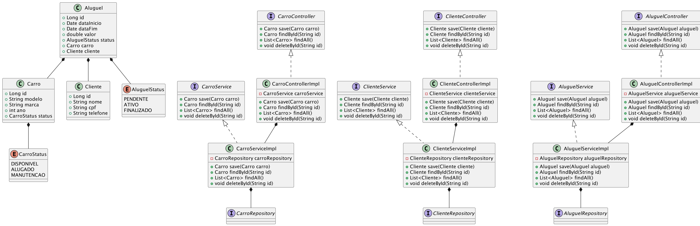

# Rent Cars API

O objetivo deste projeto é desenvolver uma aplicação Spring Boot para gerenciamento de uma locadora de carros,
utilizando práticas de programação orientada a objetos, mapeamento objeto-relacional (ORM) com JPA, e será utilizado
como critério de avaliação.

**Obs:** Não espero que fique 100%, mas irei avaliar a lógica e o esforço envolvido também.

## Sumário

- [Funcionalidades](#funcionalidades-esperadas)
- [Requisitos](#requisitos)
- [Configuração](#configuração)
- [Acesso ao Banco de Dados](#acesso-ao-banco-de-dados)
    - [Credenciais](#credenciais)

## Funcionalidades Esperadas

- **Gerenciar Carros:** Permite o cadastro, atualização, visualização e exclusão de carros no sistema. Inclui detalhes
  como modelo, marca, ano e status.
- **Gerenciar Clientes:** Permite o cadastro, atualização, visualização e exclusão de informações de clientes, incluindo
  nome, CPF e telefone.
- **Gerenciar Aluguéis:** Facilita o registro, atualização, visualização e finalização de aluguéis, incluindo
  informações sobre datas de início e fim, valor e status do aluguel.

## Diagrama UML

Diagrama UML conforme aquivo [RentCars.puml](RentCars.puml):



## Requisitos

- JDK 21
- Maven 3.6 ou superior

## Configuração

**Instalação do JDK e Maven:**

- [Instruções para instalação do JDK](https://docs.oracle.com/en/java/javase/11/install/overview-jdk-installation.html)
- [Instruções para instalação do Maven](https://maven.apache.org/install.html)

### Banco de Dados

#### H2 (Padrão)

Por padrão, a aplicação utiliza o banco de dados H2 em memória, o que permite que a aplicação funcione mesmo sem o uso
do PostgreSQL. Não é necessário configurar nada adicionalmente para usar o H2.

#### PostgreSQL (Opcional)

Caso você queira utilizar o PostgreSQL, siga os passos abaixo:

1. Altere o perfil ativo para `prd` no arquivo `application.yml`:
    ```yaml
    spring:
      profiles:
        active: prd
    ```
2. Suba o container Docker utilizando docker-compose:
    ```bash
    docker-compose up -d
    ```

## Executando o Projeto

```bash
mvn spring-boot:run
```

Para acessar a API, utilize a seguinte URL:

- **Swagger UI (Local):** [http://localhost:8080/swagger-ui.html](http://localhost:8080/swagger-ui.html)

## Acesso ao Banco de Dados

Para acessar o banco de dados H2 utilizado pelo projeto, utilize a seguinte URL:

- **Console H2 (local):** [http://localhost:8080/h2-console](http://localhost:8080/h2-console)

## Credenciais

### H2

|                              **URL**                              | **Username** | **Password** |
|:-----------------------------------------------------------------:|:------------:|:------------:|
| `jdbc:h2:mem:rent_cars_db;DB_CLOSE_ON_EXIT=FALSE;MODE=PostgreSQL` | `rent_cars`  | `rent_cars`  |

### PostgreSQL

|  **Host**   | **Port** | **Username** | **Password** |  **Database**  |
|:-----------:|:--------:|:------------:|:------------:|:--------------:|
| `localhost` |  `5432`  | `rent_cars`  | `rent_cars`  | `rent_cars_db` |

# Instruções

## Tarefas a Serem Realizadas

1. Definição das Entidades e Relacionamentos
    - Implementem as entidades e seus relacionamentos conforme o diagrama UML apresentado.

2. Implementação dos Repositórios
    - Não é necessário implementar métodos adicionais nos repositórios, a menos que você precise de alguma
      funcionalidade específica não coberta pelos métodos padrão do JPA.

3. Implementação dos Services

    - Implemente as classes de serviço para as entidades Cliente, Carro e Aluguel.
    - ClienteService: Deve incluir métodos para salvar, buscar por ID, buscar todos, atualizar por ID e deletar por ID.
    - CarroService: Similar ao ClienteService, mas para a entidade Carro.
    - AluguelService: Deve gerenciar as operações de aluguel, incluindo criação, atualização, visualização e finalização
      de aluguéis.

4. Uso de MapStruct para Mapeamento de Objetos
    - Utilize os mapeadores configurados (MapStruct) para converter entre entidades e objetos de transferência de
      dados (DTOs) dentro das services. As instâncias dos mapeadores já estão configuradas e podem ser usadas
      diretamente.
    - Definam as classes de Request, Response e Entity para cada objeto.

5. Implementação dos Controladores
    - Os controladores REST para expor as APIs de CRUD para Cliente, Carro e Aluguel já estão implementados e anotados
      com OpenAPI.
    - Certifique-se de que as funcionalidades das services estão corretamente integradas com os controladores.

6. Validações
    - A validação dos dados de entrada nos endpoints da API é opcional.

### Pontos de Atenção

- Anotações JPA: Use corretamente anotações como @Entity, @Id, @GeneratedValue, @OneToMany, @ManyToOne, etc.
- Documentação: Verifique se a documentação Swagger para os endpoints está correta.
- Configuração: Os perfis para H2 e PostgreSQL já estão configurados.

## Como Começar

Para elaborar essa atividade, é necessário fazer um fork do projeto e seguir as orientações acima.

## Observações Finais

- Esta atividade deve ser desenvolvida exclusivamente em Java.
- Certifique-se de seguir o modelo e as práticas recomendadas conforme descrito no README.